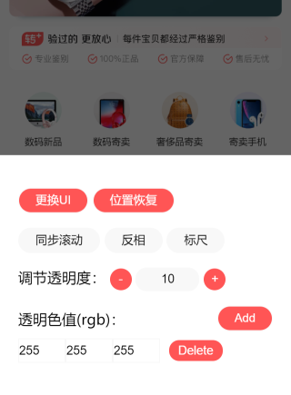

# uipx-chrome-plugin

UI图片对比插件 - chrome插件版本

## Usage

下载本仓库，然后 `chrome` 进入 `扩展程序` 界面，切换到开发者模式，点击 `加载已解压的扩展程序`，将下载下来的本仓库文件当成是 `crx`文件的解压后文件进行加载即可，具体可参考 [chrome浏览器无法离线添加扩展程序crx插件文件](https://jingyan.baidu.com/article/f71d6037c581c91ab641d120.html)
